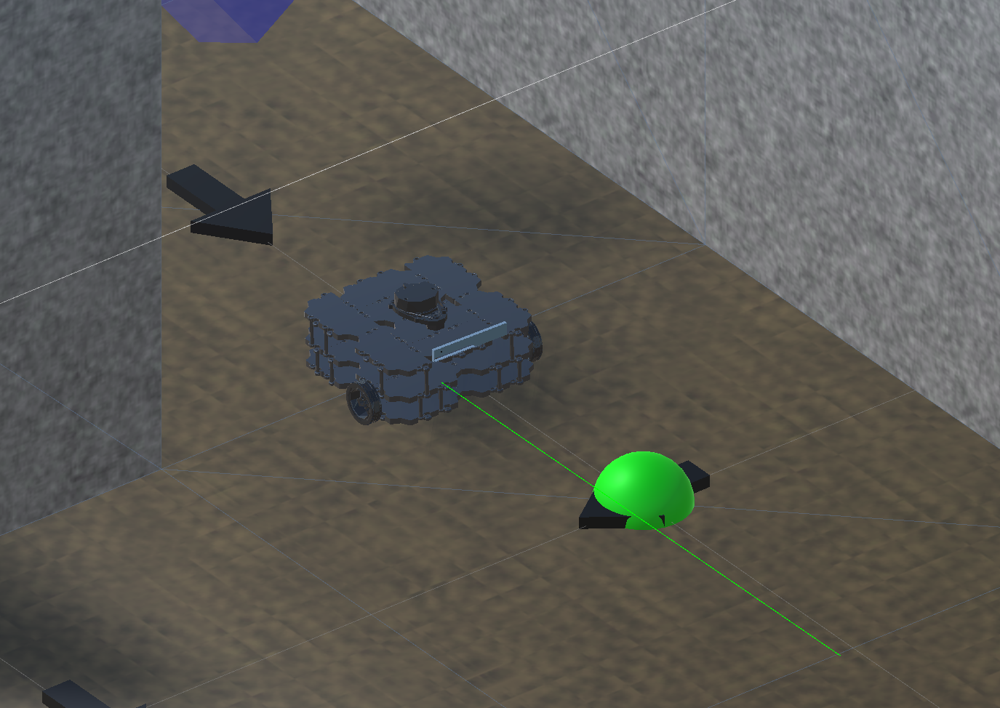

# Exercise 4: State and Manual Path Planning



## Overview
In this exercise you will learn how to write an local navigation algorithm (turn-go-turn) to be used in a manual path planner. This assumes you have completed exercises #2 & #3.

## Code Explained

You will be writing code within `Manual Path Planning Scripts/TBotTurnGoTurn.cs` and `Manual Path Planning Scripts/TBotManualPlanner.cs`.

The main funcitons you will be writing first are `UpdateStateMachine()` and `UpdateTurnGoTurn()`. `UpdateStateMachine()` will call `UpdateTurnGoTurn()` inside it.

`UpdateTurnGoTurn()` should be written as a policy of the following:
```C#
/// If close enough to the goal (defined by `goalDistTolerance`):
///     changes the state to ATGOAL and stops the robot
/// Else if the robot is not within the angle tolerance relative to the goal (defined by `angleTolerance`):
///     turns right or left to minimize the angle to the goal
/// Else:
///     drives forward
```

`UpdateStateMachine()` should react the current state of the robot and act accordingly. The states of the robot can be found in `TBotNavigationState.cs` as the following (note this function may not need to do anything explicit for all states):
```C#
public enum ROBOT_NAV_STATE
{
    NAVIGATING,
    WAITINGFORNAVGOAL,
    RECEIVEDNAVGOAL,
    ATGOAL,
    STUCK
}
```
You can test if these are implemented correctly by moving the `goal` object around within the scene view.

Next you will be creating a high level navigation plan through the maze. The example maze is given in `Assets/MazeData/exampleMazeData.txt`. You can visualize the maze by pressing the play button.

Within `TBotManualPlanner.cs` you will create a correct `ManualNavPlan`. An example incorrect plan is given for the maze. You must also complete the `SendNextGoal` function to update to the correct goal position.

Once completed, the robot should be able to navigate the whole maze! You may notice this plan only works for the given maze. The solution to this is in the next exercise where you will be creating autonomous navigation plans!

## Coding Order and Tips
- If all the comments and extra funcitons are distracting, look into your Editor's ability to do "code folding". An example of this feature can be found [here](https://code.visualstudio.com/docs/editor/codebasics#:~:text=Use%20Shift%20%2B%20Click%20on%20the,uncollapsed%20region%20at%20the%20cursor.).
- Make sure the component `TBotHighLevelPlanner` on the `turtlebot3_waffle` has the `ManualPlan` box checked
- The coding order is given in the [Code Explained](#code-explained) section above.