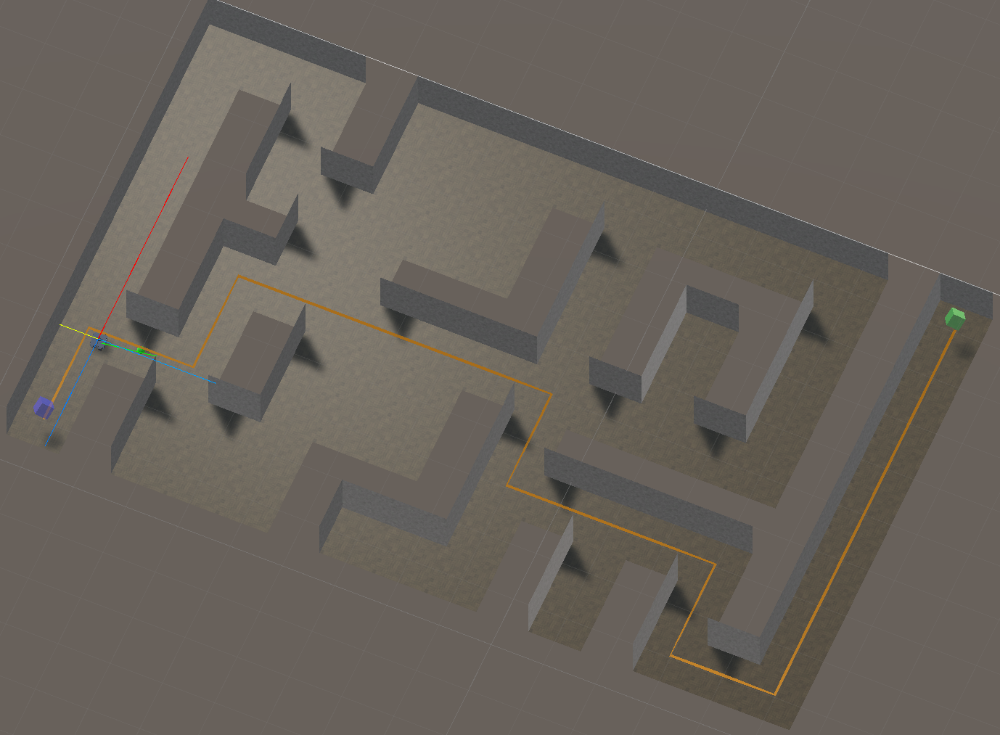

# Exercise 5: Autonomous Navigation

## Overview
In this exercise you will learn how to write an autonomous path planner. This assumes you have completed exercises #2-4.

## Code Explained

You will be writing code within `Autonomous Planning Scripts/TBotAutonomousPlanner.cs`. 

The main function you will be writng is `CreateAndVisualizePlan()`. The visualize portion is already completed for you so that you can see your plan ourput with the orange line renderer. That leaves the creation of the plan.

You are given a start and `startPos` and an `endPos`. Given these, you will want to search from start to end positions. There are many search algorithms you can use to accomplish this, I would reccomend either Breath First Search (BFS) or Depth First Search (DFS) You can also take advantage of the directions given in `RoboticsPrimer.TBotHighLevelNavPlanner` of `U`, `D`, `L`, `R`.

Skeleton code for helper functions is also provided. `UpdatedUnvisited` is there to update the unvisted set with only valid locations (i.e., not visited && in bounds) as well an add any unvisted nodes to the search data structure (e.g., stack or queue). Many search algorithms end with the sequence in reverse (start at the final position going to the start position). `BackTrack` can help write the code necessary to create the `autonomousNavPlan` in the correct order.

All functions that need coding are marking with `CODE` and found within the `#region CODE`.

## Coding Order and Tips
- If all the comments and extra funcitons are distracting, look into your Editor's ability to do "code folding". An example of this feature can be found [here](https://code.visualstudio.com/docs/editor/codebasics#:~:text=Use%20Shift%20%2B%20Click%20on%20the,uncollapsed%20region%20at%20the%20cursor.).
- There is no real coding order as there is only 1 function you must do. Use the helpers only if you find the helpful to abstract out long parts of your search routine.
- There are many search algorithms online but BFS and DFS are typically the first learned. I would highly reccomend watching online tutorials on these algorithms as well as tracing examples out by hand. This includes doing the backtracking part of the algorithm.
