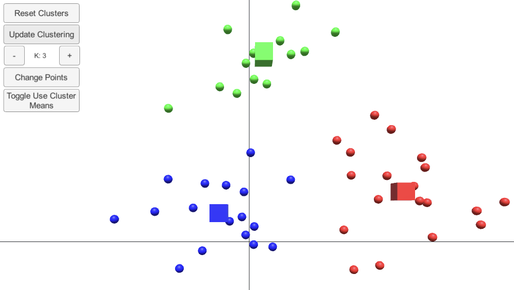

# Exercise 6: Machine Learning

## Overview
In this exercise you will learn how to write an unsupervised learning algorithm: [*k*-means clustering](https://en.wikipedia.org/wiki/K-means_clustering). 

## Code Explained

You will be writing code within `Machine Learning Scripts/KMeans.cs`. 

All functions that need coding are marking with `CODE` and found within the `#region CODE`.

## Coding Order and Tips
- If all the comments and extra funcitons are distracting, look into your Editor's ability to do "code folding". An example of this feature can be found [here](https://code.visualstudio.com/docs/editor/codebasics#:~:text=Use%20Shift%20%2B%20Click%20on%20the,uncollapsed%20region%20at%20the%20cursor.).
- When pressing play, each slider is reset to the default values. The defualt values can be changed in the Inspector view of the `PIDController.cs` script. The script is attached in the Hierarchy under `MotorLink/PendulumLink`
